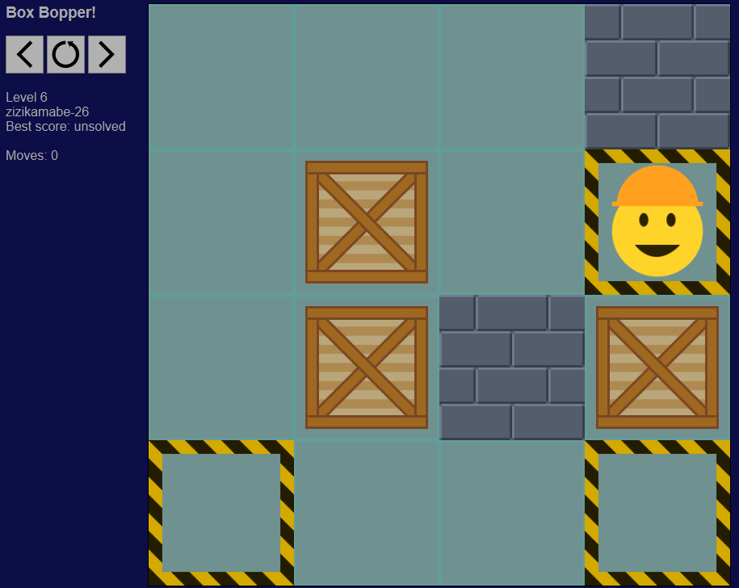

# BoxBopper

A sokoban-style game, written in rust.

There is:
- a version for the web (boxbopperweb, written in rust/wasm/javascript)
- a version for a terminal (boxboppertui)
- a tool to create and solves level (boxboppertool)

# boxbopperweb (game for web)



### Building
The web game requires node.js and webpack to build.

Use `npm run build` in the `boxbopperweb` directory to build the web game.  

Use `npm run start` to run the game locally, which can then be accessed from your web browser (typically http://localhost:8080/).

### Usage

Pardon the basic graphics!

Use arrow keys to move around. You can also move (in straight lines only) with the mouse.

Press `R` to reset, `N` for next level, `P` for previous level, or click the appropriate buttons.

# boxboppertui (game for terminal)


### Building

Use `cargo build --release` in the `boxboppertui` directory to build the terminal game.  
(You may first need to run `cargo build --release` in the root directory to build the `boxbopperbase` library.)

### Usage

#### Command-line options:

```
filename=FILENAME      load level from FILENAME
builtin=NUM            start with builtin level NUM       0-78
use_emoji=true         use emoji for display              true / false
basic_ui=true          use a basic ui only                true / false
```

#### Playing the game:

Type `U`, `D`, `L`, `R` to move around.  
Type `N` or `P` for next or previous level.  
Type \` to reset the level.  
Type `Q` to quit.  

# boxboppertool

This tool can create and solve levels. It is multithreaded, and uses an exhaustive search. It is quite fast at solving levels,
provided the level is within limits. If the level is not within limits, it'll probably fail.

Limits are:
- Width and height must both be <= 127
- Width TIMES height must be <= 256
- Number of boxes must be < 24
- Number of boxes should be < 12 to increase chance of success
- Number of moves required to finish level must be < 256
- The amount of free memory on your PC
- Not too much open space (e.g. 3x4 and above)

### Building
Use `cargo build --release` in the `boxboppertool` directory to build the (console) tool.

### Usage
```
boxboppertool make [vars...]
boxboppertool solve [vars...]
boxboppertool speed_test [vars...]

vars for make:
  seed=n           rng seed (u32)
  width=n          level width 5-15                              default: 5
  height=n         level height 5-15                             default: 5
  box_density=n    box density 1-99                              default: 20
  wall_density=n   wall density 1-99                             default: 20
  max_depth=n      maximum depth to try to reach 1+              default: 100
vars for solve:
  max_moves=n      maximum number of moves to try 1-255          default: 200
  builtin=n        builtin level to solve
  filename=f       custom level filename to solve
vars for speed_test:
  max_level=n      maximum level to test up to                   default: 20
  speed_test_read=f   filename to compare results with
  speed_test_write=f  filename to write results to
vars for all:
  verbosity=n      how much information to provide 0-2           default: 1
  threads=n        how many cpu threads to use 0=auto            default: 0
  max_maps=n       max maps to have in memory                    default: 4000000

lower max_maps to reduce memory usage (but it may not solve)
lower max_moves to improve performance (but it will not solve if more moves are required)
```

# License

Copyright 2020-2021 David Atkinson. 
