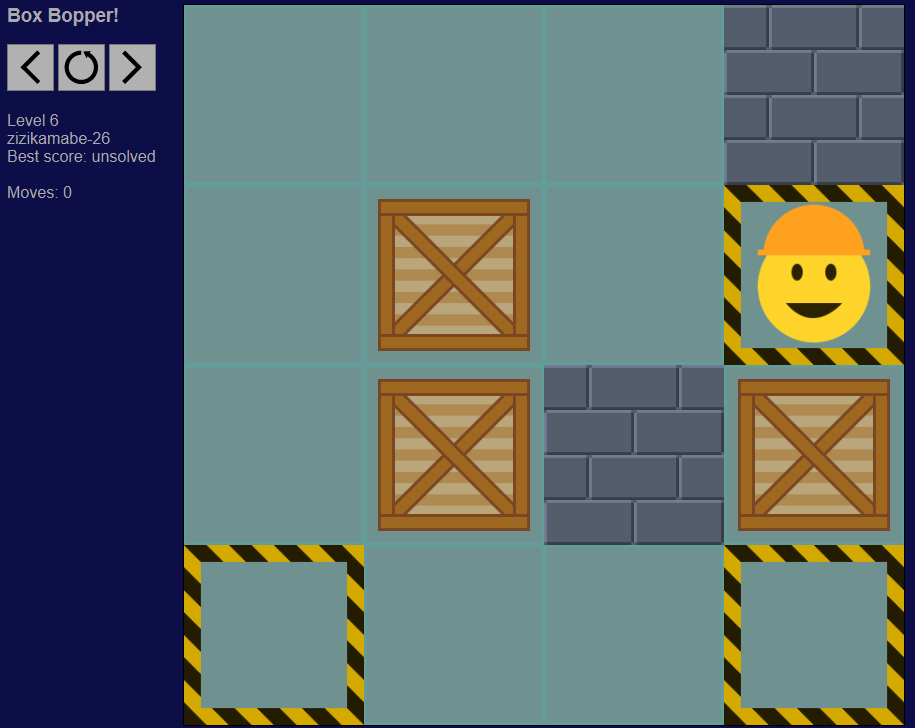
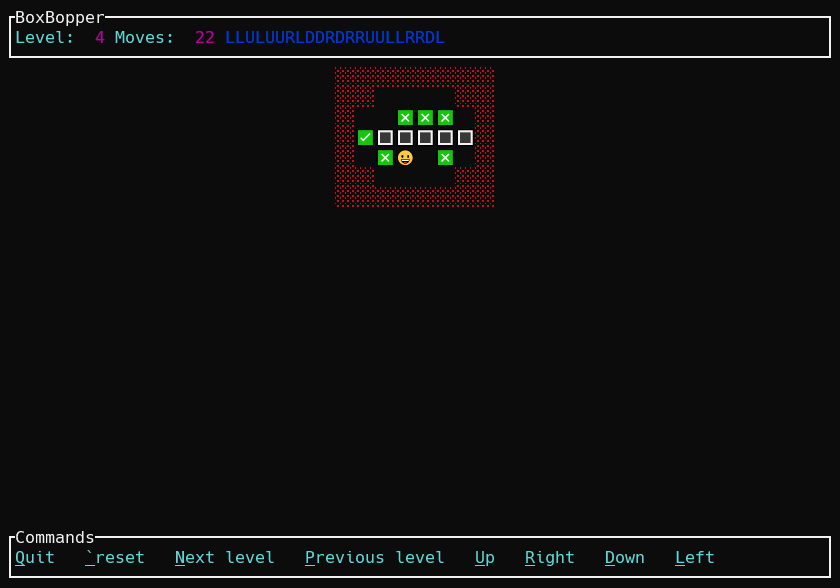

# BoxBopper

A sokoban-style game, written in rust.

There is:
- a version for the web (boxbopperweb, written in rust/javascript)
- a version for a terminal (boxboppertui)
- a tool to create and solve levels (boxboppertool)

# boxbopperweb (game for web)

[Play the game!](https://boxbopper.tacticat.co/)



### Building

Tested using Rust 1.72 and nodejs 18.17 LTS.

The web game requires wasm-pack to build.

Use `wasm-pack build` in the root directory to build the required wasm module and javascript interface.

Use `npm run build` in the `boxbopperweb2` directory to build the web game.

Use `npm run serve` to run the game locally.

e.g.
```
cd boxbopper
cargo install wasm-pack
cargo build
wasm-pack build
cd boxbopperweb2
npm run build
npm run serve
```

# boxboppertui (game for terminal)



### Building

Use `cargo build` in the `boxboppertui` directory to build the terminal game.  

e.g.
```
cd boxbopper/boxboppertui
cargo build
./target/debug/boxboppertui
```

### Command-line options

```
filename=FILENAME      load level from FILENAME
builtin=NUM            start with builtin level NUM       0-78
use_emoji=true         use emoji for display              true / false
basic_ui=true          use a basic ui only                true / false
```

# boxboppertool

This tool can create and solve levels. It is multithreaded, and uses an exhaustive search. It is quite fast at solving levels,
provided the level is within limits. If the level is not within limits, it'll probably fail.

Limits are:
- Width and height must both be <= 127
- Width TIMES height must be <= 256
- Number of boxes must be < 24
- Number of boxes should be < 12 to increase chance of success
- Number of moves required to finish level must be < 256
- The amount of free memory on your PC
- Not too much open space (e.g. 3x4 and above)

### Building

Use `cargo build` in the `boxboppertool` directory to build the (console) tool.

e.g.
```
cd boxbopper/boxboppertui
cargo build --release
./target/release/boxboppertool speed_test max_level=10
```

### Usage
```
boxboppertool make [vars...]
boxboppertool solve [vars...]
boxboppertool speed_test [vars...]

vars for make:
  seed=n           rng seed (u32)
  width=n          level width 5-15                              default: 5
  height=n         level height 5-15                             default: 5
  box_density=n    box density 1-99                              default: 20
  wall_density=n   wall density 1-99                             default: 20
  max_depth=n      maximum depth to try to reach 1+              default: 100
vars for solve:
  max_moves=n      maximum number of moves to try 1-255          default: 200
  builtin=n        builtin level to solve
  filename=f       custom level filename to solve
vars for speed_test:
  max_level=n      maximum level to test up to                   default: 20
  speed_test_read=f   filename to compare results with
  speed_test_write=f  filename to write results to
vars for all:
  verbosity=n      how much information to provide 0-2           default: 1
  threads=n        how many cpu threads to use 0=auto            default: 0
  max_maps=n       max maps to have in memory                    default: 4000000

lower max_maps to reduce memory usage (but it may not solve)
lower max_moves to improve performance (but it will not solve if more moves are required)
```

# License

Copyright 2020-2021 David Atkinson. 
